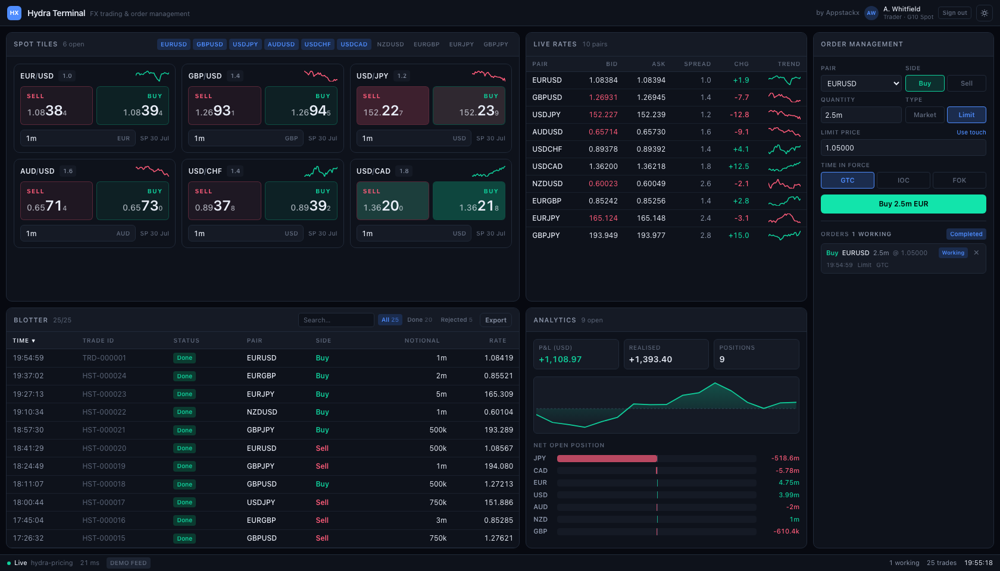
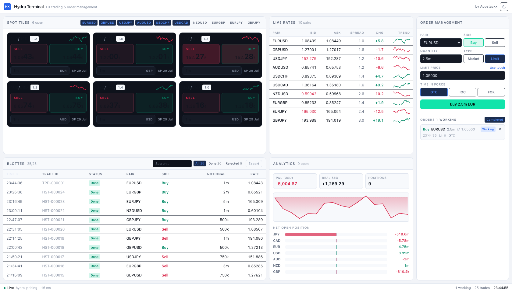
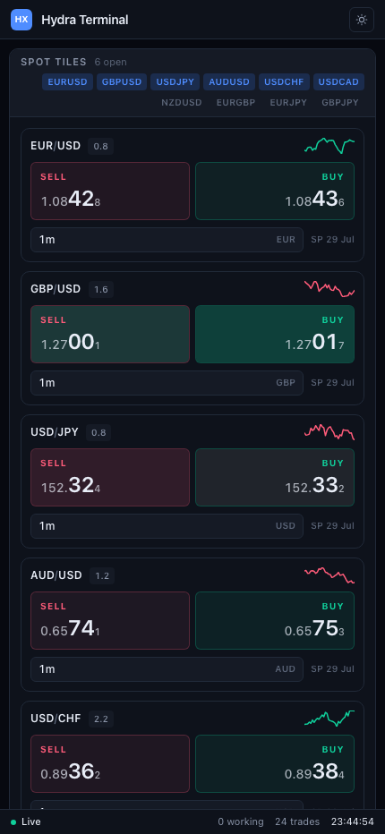

# Hydra Terminal

[](https://github.com/appstackx/hydra-trading-ui/actions/workflows/ci.yml)
[](LICENSE)

A white-label FX trading and order-management interface — live spot tiles, a blotter, real-time
analytics and an OMS — built as a **UI-only product**: it renders and executes against whatever
back end you plug in, and ships with a simulated one so it runs standalone.

Reference implementation by [Appstackx](https://appstackx.co.uk).



<details>
<summary>Light theme and narrow viewport</summary>





</details>

<sub>Screenshots are generated, not hand-captured — `npm run screenshots` drives the real app
through Playwright at a pinned seed, so they cannot drift from what the code actually renders.</sub>

---

## Why this exists

Trading front ends are consistently the most expensive and least differentiated part of a capital
markets build. Every venue, broker and prop desk needs the same seven things — a dealable price
tile, a blotter, positions, P&L, an order ticket, a working-order book, a market watch — and every
one of them rebuilds it.

This repository is the argument that the UI can be a separate, licensable layer:

- **The UI owns no data.** It depends on four interfaces (`MarketDataPort`, `ExecutionPort`,
  `OrderPort`, `TradePort`) and nothing else. See [`src/services/ports.ts`](src/services/ports.ts).
- **The UI holds no money and touches no client record.** It is a rendering and order-entry layer
  installed inside the licensee's environment, pointed at the licensee's own venue.
- **The UI is re-skinnable without a fork.** Every colour, radius and font resolves to a CSS custom
  property; product name, vendor and accent come from build-time environment variables.

The commercial reasoning behind that split — where the regulatory perimeter actually sits, and how
a UI-only licence is priced and sold — is in [`docs/business-model.md`](docs/business-model.md).

## What is in the box

| Area                 | What it does                                                                                                                                                                                                                      |
| -------------------- | --------------------------------------------------------------------------------------------------------------------------------------------------------------------------------------------------------------------------------- |
| **Spot tiles**       | Live two-way prices split into big figure / pips / fractional pip, tick flash, notional entry in desk shorthand (`1m`, `250k`, `2bn`), one-click execution, in-flight and result overlays including the venue's rejection reason. |
| **Blotter**          | Every ticket attempted this session — dealt and rejected — sortable on any column, filterable by status and free text, exportable to RFC 4180 CSV.                                                                                |
| **Analytics**        | Position book marked on every tick, realised/unrealised split, session P&L chart, and net open position per currency. All P&L is converted to a single reporting currency before it is summed.                                    |
| **Order management** | Market and limit orders, GTC / IOC / FOK, resting orders that fill the moment the market prints through them, clip-by-clip partial fills with VWAP, per-order cancel.                                                             |
| **Live rates**       | Full market watch across every quoted instrument with spread, session change in pips and a trend line.                                                                                                                            |
| **Chrome**           | Transport health and latency, session counts, clock, dark/light themes that follow the OS until the user chooses.                                                                                                                 |

Ten G10 pairs are quoted, deliberately mixing 5-decimal majors and 3-decimal yen crosses — that is
where rate-formatting bugs hide.

## Running it

```bash
npm install && npm run dev
```

Then open <http://localhost:5173>.

The demo feed is deterministic. Pin it with a seed to get an identical session every time — the
same opening rates, the same seeded blotter, the same sequence of venue rejections:

```bash
open "http://localhost:5173/?seed=4242"
```

## Verifying it

```bash
npm run verify
```

That runs lint (zero warnings tolerated), the unit suite with coverage thresholds, and a production
build. The end-to-end suite is separate because it builds and serves the app first:

```bash
npm run test:e2e
```

| Suite                                       | Count | Notes                                               |
| ------------------------------------------- | ----- | --------------------------------------------------- |
| Unit / component (Vitest + Testing Library) | 390   | 99% statements, 95% branches, enforced by threshold |
| End-to-end (Playwright)                     | 122   | Desktop Chromium, desktop Firefox, mobile Chrome    |

Everything time- or randomness-dependent is injectable: the price feed takes a seeded generator and
a clock, the execution venue takes a `delay` function, and component tests drive prices by hand
through a stub in [`src/test/harness.tsx`](src/test/harness.tsx). No test sleeps.

## Architecture

```
src/
  domain/      Pure business logic — pricing maths, position keeping, order rules, formatting.
               No React, no RxJS, no transport. 100% unit tested.
  services/    ports.ts defines the four interfaces the UI is written against.
               mock/ is one implementation; a licensee's gateway is another.
               create-services.ts is the only file that names a concrete adapter.
  hooks/       Observable-to-React bridge (useSyncExternalStore, so a fast feed cannot tear).
  components/  Design-system primitives: Panel, Button, Sparkline.
  features/    Spot tiles, blotter, analytics, live rates, order management.
  app/         Shell, providers, per-region error boundaries.
  theme/       Design tokens and white-label configuration.
e2e/           Playwright specs.
```

The dependency rule is one-directional: `features` → `hooks` → `services/ports` → `domain`. Nothing
in `domain` knows the UI exists, and nothing in `features` knows which adapter is installed.

### Connecting a real back end

Implement the four ports and return them from `createServices()`:

```ts
export function createServices(): Services {
  const socket = new YourGatewayClient(config)
  return {
    marketData: new YourMarketDataAdapter(socket),
    execution: new YourExecutionAdapter(socket),
    orders: new YourOrderAdapter(socket),
    trades: new YourTradeStore(socket),
    dispose: () => socket.close(),
  }
}
```

Nothing above that file changes. The tiles, blotter, analytics and OMS are unaware of the swap.

### White-labelling

Colours are CSS custom properties defined in [`src/index.css`](src/index.css) and overridden per
theme. Product identity comes from the environment at build time:

```bash
VITE_BRAND_PRODUCT_NAME="Northgate FX" \
VITE_BRAND_PRODUCT_INITIALS="NG" \
VITE_BRAND_VENDOR_NAME="Northgate Markets" \
VITE_BRAND_VENDOR_URL="https://example.com" \
VITE_BRAND_ACCENT="#c0463b" \
npm run build
```

One codebase, a differently-branded bundle per licensee, no fork.

## Design decisions worth knowing

- **P&L is converted before it is summed.** A book holding EURUSD and USDJPY has P&L in dollars and
  in yen. `totalPnl` converts every leg to the reporting currency and _names_ anything it cannot
  convert rather than quietly adding the two together.
- **Rejected trades stay in the blotter.** A blotter is an audit trail of what was attempted, not a
  list of what succeeded.
- **Each live-rates row subscribes to its own instrument.** A shared subscription would re-render
  all ten rows about thirty times a second.
- **The tick flash is CSS keyed on the quote timestamp.** Driving it from state and a timer would
  cost a React render per tick, per tile.
- **Every panel has its own error boundary.** If analytics throws, the tiles and blotter keep
  trading. A blank dealing screen is the worst possible outcome.
- **The demo back end is a module-level singleton.** Tying it to a component's effect cleanup means
  React StrictMode's double-mount tears the connection down in development.

## Provenance and scope

The feature set is modelled on [Reactive Trader Cloud](https://github.com/AdaptiveConsulting/ReactiveTraderCloud)
(Adaptive Consulting, Apache-2.0), a well-known public reference for reactive trading UIs. This is
an independent implementation written from that feature brief — no code was copied — with an
adapter architecture and an OMS panel added to make the UI-only licensing model concrete.

**This is a demonstration build, not a production trading system.** Prices are simulated, execution
is simulated, and there is no authentication, entitlement, audit log, kill switch, market-data
licensing or regulatory reporting. Those are the licensee's responsibility and are discussed in
[`docs/business-model.md`](docs/business-model.md).

## Licence

Apache-2.0. See [LICENSE](LICENSE).
